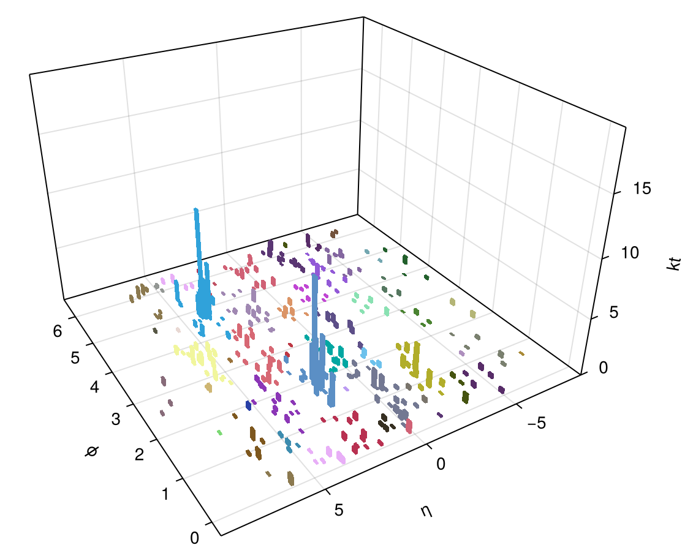

# JetReconstruction.jl

[](https://github.com/JuliaHEP/JetReconstruction.jl/actions/workflows/CI.yml?query=branch%3Amain)

## This package implements sequential Jet Reconstruction (clustering)

### Algorithms

Algorithms used are based on the C++ FastJet package (<https://fastjet.fr>,
[hep-ph/0512210](https://arxiv.org/abs/hep-ph/0512210),
[arXiv:1111.6097](https://arxiv.org/abs/1111.6097)), reimplemented natively in Julia.

The algorithms include anti-${k}_\text{T}$, Cambridge/Aachen and inclusive $k_\text{T}$.

### Interface

The simplest interface is to call:

```julia
cs = jet_reconstruct(particles::Vector{T}; p = -1, R = 1.0, recombine = +, strategy = RecoStrategy.Best)
```

- `particles` - a vector of input particles for the clustering
  - Any type that supplies the methods `pt2()`, `phi()`, `rapidity()`, `px()`, `py()`, `pz()`, `energy()` can be used
  - These methods have to be defined in the namespace of this package, i.e., `JetReconstruction.pt2(::T)`
  - The `PseudoJet` type from this package, or a 4-vector from `LorentzVectorHEP` are suitable (and have the appropriate definitions)
- `p` - the transverse momentum power used in the $d_{ij}$ metric for deciding on closest jets, as $k^{2p}_\text{T}$. Different values of $p$ then give different reconstruction algorithms:
  - `-1` gives anti-$`{k}_\text{T}`$ clustering (default)
  - `0` gives Cambridge/Aachen
  - `1` gives inclusive $k_\text{T}$
- `R` - the cone size parameter; no particles more geometrically distance than `R` will be merged (default 1.0)
- `recombine` - the function used to merge two pseudojets (default is a simple 4-vector addition of $`(E, \mathbf{p})`$)
- `strategy` - the algorithm strategy to adopt, as described below (default `RecoStrategy.Best`)

The object returned is a `ClusterSequence`, which internally tracks all merge steps.

To obtain the final inclusive jets, use the `inclusive_jets` method:

```julia
final_jets = inclusive_jets(cs::ClusterSequence; ptmin=0.0)
```

Only jets passing the cut $p_T > p_{Tmin}$ will be returned. The result is returned as a `Vector{LorentzVectorHEP}`.

#### Sorting

As sorting vectors is trivial in Julia, no special sorting methods are provided. As an example, to sort exclusive jets of $>5.0$ (usually GeV, depending on your EDM) from highest energy to lowest:

```julia
sorted_jets = sort!(inclusive_jets(cs::ClusterSequence; ptmin=5.0), by=JetReconstruction.energy, rev=true)
```

#### Strategy

Three strategies are available for the different algorithms:

| Strategy Name | Notes | Interface |
|---|---|---|
| `RecoStrategy.Best` | Dynamically switch strategy based on input particle density | `jet_reconstruct` |
| `RecoStrategy.N2Plain` | Global matching of particles at each interation (works well for low $N$) | `plain_jet_reconstruct` |
| `RecoStrategy.N2Tiled` | Use tiles of radius $R$ to limit search space (works well for higher $N$) | `tiled_jet_reconstruct` |

Generally one can use the `jet_reconstruct` interface, shown above, as the *Best* strategy safely as the overhead is extremely low. That interface supports a `strategy` option to switch to a different option.

Another option, if one wishes to use a specific strategy, is to call that strategy's interface directly, e.g.,

```julia
# For N2Plain strategy called directly
plain_jet_reconstruct(particles::Vector{T}; p = -1, R = 1.0, recombine = +)
```

Note that there is no `strategy` option in these interfaces.

### Examples

In the examples directory there are a number of example scripts.

See the `jetreco.jl` script for an example of how to call jet reconstruction.

```sh
julia --project=. examples/jetreco.jl --maxevents=100 --nsamples=1 --strategy=N2Plain test/data/events.hepmc3
...
julia --project=. examples/jetreco.jl --maxevents=100 --nsamples=1 --strategy=N2Tiled test/data/events.hepmc3
...
```

There are options to explicitly set the algorithm (use `--help` to see these).

The example also shows how to use `JetReconstruction.HepMC3` to read HepMC3
ASCII files (via the `read_final_state_particles()` wrapper).

Further examples, which show visualisation, timing measurements, profiling, etc.
are given - see the `README.md` file in the examples directory.

Note that due to additional dependencies the `Project.toml` file for the
examples is different from the package itself.

### Plotting



To visualise the clustered jets as a 3d bar plot (see illustration above) we now
use `Makie.jl`. See the `jetsplot` function in `ext/JetVisualisation.jl` and its
documentation for more. There are two worked examples in the `examples`
directory.

The plotting code is a package extension and will load if the one of the `Makie`
modules is loaded in the environment.

### Serialisation

The package also provides methods such as `loadjets`, `loadjets!`, and
`savejets` that one can use to save and load objects on/from disk easily in a
very flexible format. See documentation for more.

## Reference

Although it has been developed further since the CHEP2023 conference, the CHEP
conference proceedings, [arXiv:2309.17309](https://arxiv.org/abs/2309.17309),
should be cited if you use this package:

```bibtex
@misc{stewart2023polyglot,
      title={Polyglot Jet Finding}, 
      author={Graeme Andrew Stewart and Philippe Gras and Benedikt Hegner and Atell Krasnopolski},
      year={2023},
      eprint={2309.17309},
      archivePrefix={arXiv},
      primaryClass={hep-ex}
}
```

## Authors and Copyright

Code in this package is authored by:

- Atell Krasnopolski <delta_atell@protonmail.com>
- Graeme A Stewart <graeme.andrew.stewart@cern.ch>
- Philippe Gras <philippe.gras@cern.ch>

and is Copyright 2022-2024 The Authors, CERN.

The code is under the MIT License.
