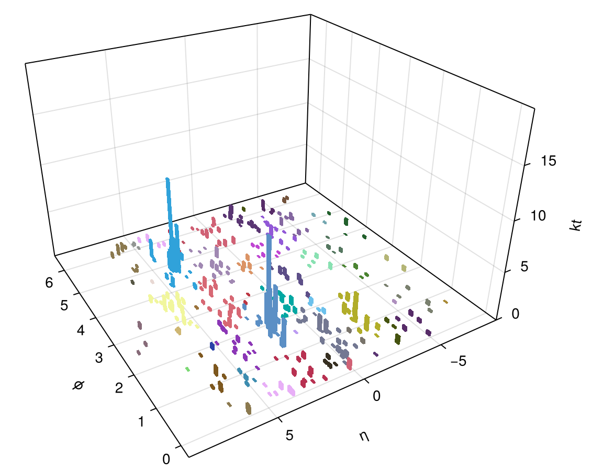

# JetReconstruction.jl
<!-- ALL-CONTRIBUTORS-BADGE:START - Do not remove or modify this section -->
[](#contributors-)
<!-- ALL-CONTRIBUTORS-BADGE:END -->

[](https://github.com/JuliaHEP/JetReconstruction.jl/actions/workflows/CI.yml?query=branch%3Amain)
[](https://zenodo.org/doi/10.5281/zenodo.12671414)
[](https://juliahep.github.io/JetReconstruction.jl/stable)
[](https://juliahep.github.io/JetReconstruction.jl/dev)
[](https://github.com/JuliaTesting/Aqua.jl)

## This package implements sequential Jet Reconstruction (clustering)

### Algorithms

Algorithms used are based on the C++ FastJet package (<https://fastjet.fr>,
[hep-ph/0512210](https://arxiv.org/abs/hep-ph/0512210),
[arXiv:1111.6097](https://arxiv.org/abs/1111.6097)), reimplemented natively in Julia.

The algorithms include anti-$`{k}_\text{T}`$, Cambridge/Aachen, inclusive
$`k_\text{T}`$, generalised $`k_\text{T}`$ for $`pp`$ events; and the Durham
algorithm and generalised $`k_\text{T}`$ for $`e^+e^-`$.

### Interface

The simplest interface is to call:

```julia
cs = jet_reconstruct(particles::AbstractArray{T, 1}; algorithm = JetAlgorithm.AntiKt, R = 1.0, [p = -1,] [recombine = +,] [strategy = RecoStrategy.Best])
```

- `particles` - a one dimensional array (vector) of input particles for the clustering
  - Any type that supplies the methods `pt2()`, `phi()`, `rapidity()`, `px()`, `py()`, `pz()`, `energy()` can be used
  - These methods have to be defined in the namespace of this package, i.e., `JetReconstruction.pt2(::T)`
  - The `PseudoJet` or `EEjet` types from this package, a 4-vector from `LorentzVectorHEP`, or a `ReconstructedParticle` from [EDM4hep](https://github.com/peremato/EDM4hep.jl) are suitable (and have the appropriate definitions)
- `algorithm` is the name of the jet algorithm to be used (from the `JetAlgorithm` enum)
  - `JetAlgorithm.AntiKt` anti-$`{k}_\text{T}`$ clustering (default)
  - `JetAlgorithm.CA` Cambridge/Aachen clustering
  - `JetAlgorithm.Kt` inclusive $k_\text{T}$
  - `JetAlgorithm.GenKt` generalised $k_\text{T}$ (which also requires specification of `p`)
  - `JetAlgorithm.Durham` the $e^+e-$ $k_\text{T}$ algorithm, also known as the Durham algorithm
  - `JetAlgorithm.EEKt` the $e^+e-$ generalised $k_\text{T}$ algorithm
- `R` - the cone size parameter; no particles more geometrically distance than `R` will be merged (default 1.0; note this parameter is ignored for the Durham algorithm)
- `recombine` - the function used to merge two pseudojets (default is a simple 4-vector addition of $`(E, \mathbf{p})`$)
- `strategy` - the algorithm strategy to adopt, as described below (default `RecoStrategy.Best`)

The object returned is a `ClusterSequence`, which internally tracks all merge steps.

Alternatively, *for pp reconstruction*, one can swap the `algorithm=...`
parameter for the value of `p`, the transverse momentum power used in the
$d_{ij}$ metric for deciding on closest jets, as $k^{2p}_\text{T}$. Different
values of $p$ then correspond to different reconstruction algorithms:

- `-1` gives anti-$`{k}_\text{T}`$ clustering (default)
- `0` gives Cambridge/Aachen
- `1` gives inclusive $k_\text{T}$

Note, for the `GenKt` and `EEKt` algorithms the `p` value *must* also be given to specify the algorithm fully.

To obtain the final inclusive jets, use the `inclusive_jets` method:

```julia
final_jets = inclusive_jets(cs::ClusterSequence; ptmin=0.0)
```

Only jets passing the cut $p_T > p_{Tmin}$ will be returned. The result is returned as a `Vector{LorentzVectorHEP}`, but different return types can be specified (e.g., `T = EEjet`).

#### Sorting

As sorting vectors is trivial in Julia, no special sorting methods are provided. As an example, to sort exclusive jets of $>5.0$ (usually GeV, depending on your EDM) from highest energy to lowest:

```julia
sorted_jets = sort!(inclusive_jets(cs::ClusterSequence; ptmin=5.0), by=JetReconstruction.energy, rev=true)
```

#### Strategy

Three strategies are available for the different algorithms:

| Strategy Name | Notes | Interface |
|---|---|---|
| `RecoStrategy.Best` | Dynamically switch strategy based on input particle density | `jet_reconstruct` |
| `RecoStrategy.N2Plain` | Global matching of particles at each interation (works well for low $N$) | `plain_jet_reconstruct` |
| `RecoStrategy.N2Tiled` | Use tiles of radius $R$ to limit search space (works well for higher $N$) | `tiled_jet_reconstruct` |

Generally one can use the `jet_reconstruct` interface, shown above, as the *Best* strategy safely as the overhead is extremely low. That interface supports a `strategy` option to switch to a different option.

Another option, if one wishes to use a specific strategy, is to call that strategy's interface directly, e.g.,

```julia
# For N2Plain strategy called directly
plain_jet_reconstruct(particles::Vector{T}; algorithm = JetAlgorithm.AntiKt, R = 1.0, recombine = +)
```

Note that there is no `strategy` option in these interfaces.

### Examples

In the examples directory there are a number of example scripts.

See the `jetreco.jl` script for an example of how to call jet reconstruction.

```sh
julia --project=examples examples/jetreco.jl --algorithm=AntiKt test/data/events.pp13TeV.hepmc3.gz
...
julia --project=examples examples/jetreco.jl --algorithm=Durham test/data/events.eeH.hepmc3.gz
...
julia --project=examples examples/jetreco.jl --maxevents=10 --strategy=N2Plain --algorithm=Kt --exclusive-njets=3 test/data/events.pp13TeV.hepmc3.gz
...
```

There are options to explicitly set the algorithm (use `--help` to see these).

The example also shows how to use `JetReconstruction.HepMC3` to read HepMC3
ASCII files (via the `read_final_state_particles()` wrapper).

Further examples, which show visualisation, timing measurements, profiling, etc.
are given - see the `README.md` file in the examples directory.

Note that due to additional dependencies the `Project.toml` file for the
examples is different from the package itself.

### Plotting



To visualise the clustered jets as a 3d bar plot (see illustration above) we now
use `Makie.jl`. See the `jetsplot` function in `ext/JetVisualisation.jl` and its
documentation for more. There are two worked examples in the `examples`
directory.

The plotting code is a package extension and will load if the one of the `Makie`
modules is loaded in the environment.

### Serialisation

The package also provides methods such as `loadjets`, `loadjets!`, and
`savejets` that one can use to save and load objects on/from disk easily in a
very flexible format. See documentation for more.

## Reference

Although it has been developed further since the CHEP2023 conference, the CHEP
conference proceedings, [arXiv:2309.17309](https://arxiv.org/abs/2309.17309),
should be cited if you use this package:

```bibtex
@misc{stewart2023polyglot,
      title={Polyglot Jet Finding}, 
      author={Graeme Andrew Stewart and Philippe Gras and Benedikt Hegner and Atell Krasnopolski},
      year={2023},
      eprint={2309.17309},
      archivePrefix={arXiv},
      primaryClass={hep-ex}
}
```

## Copyright

Code in this package is Copyright 2022-2025 Graeme A Stewart, Philippe Gras, Atell Krasnopolski, CERN.

The code is under the MIT License.

## Contributors ✨

Thanks goes to these contributors to this code ([emoji key](https://allcontributors.org/docs/en/emoji-key)):

<!-- ALL-CONTRIBUTORS-LIST:START - Do not remove or modify this section -->
<!-- prettier-ignore-start -->
<!-- markdownlint-disable -->
<table>
  <tbody>
    <tr>
      <td align="center" valign="top" width="14.28%"><a href="https://graeme-a-stewart.github.io"><br /><sub><b>Graeme A Stewart</b></sub></a><br /><a href="#infra-graeme-a-stewart" title="Infrastructure (Hosting, Build-Tools, etc)">🚇</a> <a href="https://github.com/JuliaHEP/JetReconstruction.jl/commits?author=graeme-a-stewart" title="Tests">⚠️</a> <a href="https://github.com/JuliaHEP/JetReconstruction.jl/commits?author=graeme-a-stewart" title="Documentation">📖</a> <a href="https://github.com/JuliaHEP/JetReconstruction.jl/commits?author=graeme-a-stewart" title="Code">💻</a> <a href="#example-graeme-a-stewart" title="Examples">💡</a> <a href="https://github.com/JuliaHEP/JetReconstruction.jl/pulls?q=is%3Apr+reviewed-by%3Agraeme-a-stewart" title="Reviewed Pull Requests">👀</a></td>
      <td align="center" valign="top" width="14.28%"><a href="https://github.com/grasph"><br /><sub><b>Philippe Gras</b></sub></a><br /><a href="https://github.com/JuliaHEP/JetReconstruction.jl/commits?author=grasph" title="Tests">⚠️</a> <a href="https://github.com/JuliaHEP/JetReconstruction.jl/commits?author=grasph" title="Documentation">📖</a> <a href="https://github.com/JuliaHEP/JetReconstruction.jl/commits?author=grasph" title="Code">💻</a> <a href="#example-grasph" title="Examples">💡</a></td>
      <td align="center" valign="top" width="14.28%"><a href="https://atell.neocities.org/"><br /><sub><b>Atell Krasnopolski</b></sub></a><br /><a href="https://github.com/JuliaHEP/JetReconstruction.jl/commits?author=gojakuch" title="Tests">⚠️</a> <a href="https://github.com/JuliaHEP/JetReconstruction.jl/commits?author=gojakuch" title="Documentation">📖</a> <a href="https://github.com/JuliaHEP/JetReconstruction.jl/commits?author=gojakuch" title="Code">💻</a> <a href="#example-gojakuch" title="Examples">💡</a></td>
      <td align="center" valign="top" width="14.28%"><a href="https://github.com/sattwamo"><br /><sub><b>Sattwamo Ghosh</b></sub></a><br /><a href="https://github.com/JuliaHEP/JetReconstruction.jl/commits?author=sattwamo" title="Tests">⚠️</a> <a href="https://github.com/JuliaHEP/JetReconstruction.jl/commits?author=sattwamo" title="Documentation">📖</a> <a href="https://github.com/JuliaHEP/JetReconstruction.jl/commits?author=sattwamo" title="Code">💻</a> <a href="#example-sattwamo" title="Examples">💡</a></td>
      <td align="center" valign="top" width="14.28%"><a href="http://blog.jling.dev"><br /><sub><b>Jerry Ling</b></sub></a><br /><a href="https://github.com/JuliaHEP/JetReconstruction.jl/commits?author=Moelf" title="Documentation">📖</a></td>
      <td align="center" valign="top" width="14.28%"><a href="https://github.com/hegner"><br /><sub><b>hegner</b></sub></a><br /><a href="https://github.com/JuliaHEP/JetReconstruction.jl/commits?author=hegner" title="Documentation">📖</a></td>
      <td align="center" valign="top" width="14.28%"><a href="http://m-fila.github.io"><br /><sub><b>Mateusz Jakub Fila</b></sub></a><br /><a href="https://github.com/JuliaHEP/JetReconstruction.jl/commits?author=m-fila" title="Documentation">📖</a> <a href="#infra-m-fila" title="Infrastructure (Hosting, Build-Tools, etc)">🚇</a> <a href="https://github.com/JuliaHEP/JetReconstruction.jl/commits?author=m-fila" title="Tests">⚠️</a></td>
    </tr>
  </tbody>
</table>

<!-- markdownlint-restore -->
<!-- prettier-ignore-end -->

<!-- ALL-CONTRIBUTORS-LIST:END -->

This project follows the [all-contributors](https://github.com/all-contributors/all-contributors) specification. Contributions of any kind welcome!
