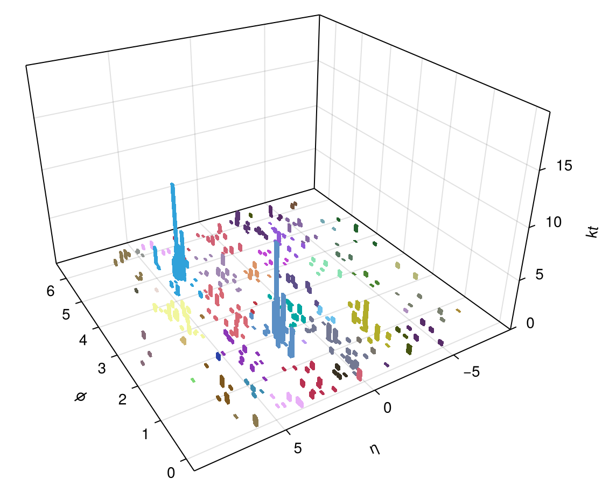

# Jet Visualisation Documentation

Documentation for visualisation interfaces extension module.

## Plotting and Animation



To visualise the clustered jets as a 3d bar plot (see illustration above)
`Makie.jl` is used. See the `jetsplot` function in `ext/JetVisualisation.jl` and
its documentation for more. There are two worked examples in the `examples`
directory of this package.

The plotting code is a package extension and will load if the one of the `Makie`
modules is loaded in the environment.

The [`animatereco`](@ref) function will animate the reconstruction sequence,
given a `ClusterSequence` object. See the function documentation below for the
many options that can be customised.

## Benchmark Timing Plots

Benchmark timing summaries are available from `JetReconstruction.jl` without a
plotting dependency. Terminal plots for repeated benchmark trial timings are
provided by the `UnicodePlots.jl` extension and are loaded when `UnicodePlots`
is available in the active environment.

```julia
using JetReconstruction
using UnicodePlots

trial_timing = [12.5, 12.1, 13.0, 12.4]
print_statistics(trial_timing)
plot_trial_times(trial_timing)
```

The [`plot_trial_times`](@ref) function prints a histogram of the trial timings
and a line plot showing the timing value for each trial.

## Function Index

```@index
Pages = ["visualisation.md"]
```

## Jet Visualisation Public Interfaces

```@autodocs
Modules = [JetVisualisation]
Order = [:function]
```

## Benchmark Plotting Public Interfaces

```@autodocs
Modules = [JetBenchmarkPlots]
Order = [:function]
```
